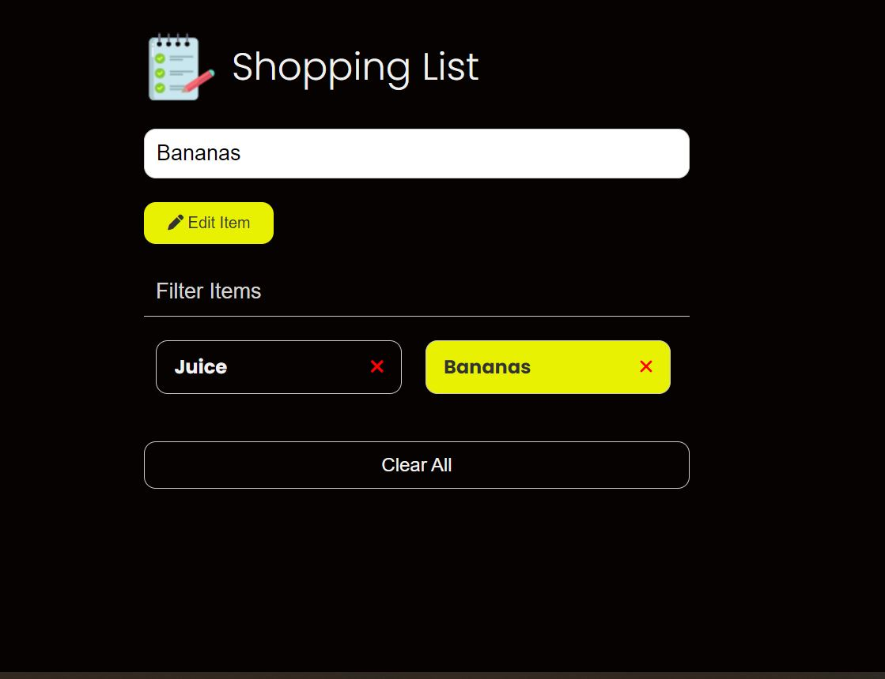

# Shopping List

Vanilla JavaScript shopping list app from Traversy course Modern JS.

This project was created to focus on working with the DOM, events, state, local storage and other fundamentals of JavaScript.

